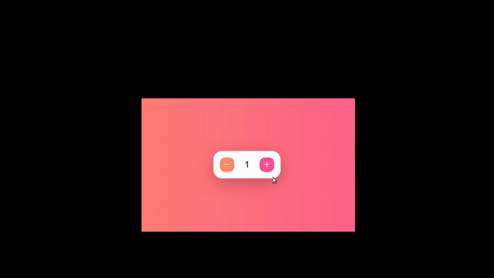

# Anim Counter

## Usage guide

import { AnimCounter } from 'anim-counter';

## Props

|                |Default value                          |Value type                         |
|----------------|-------------------------------|-----------------------------|
|disabled|`'false'`|boolean, undefined|
|duration|`150`|number, undefined|
|minusIcon|`svg icon`|any|
|plusIcon|`svg icon`|any|
|onChange|`undefined`|(newValue) => void, undefined|

## Classnames

|                |Info                                                   |
|----------------|-------------------------------|
|classes.root|`Root of component`|
|classes.labelWrapper|`Wrapper of label`|
|classes.label|`Counter label`|
|classes.minus|`Minus button`|
|classes.plus|`Plus button`|